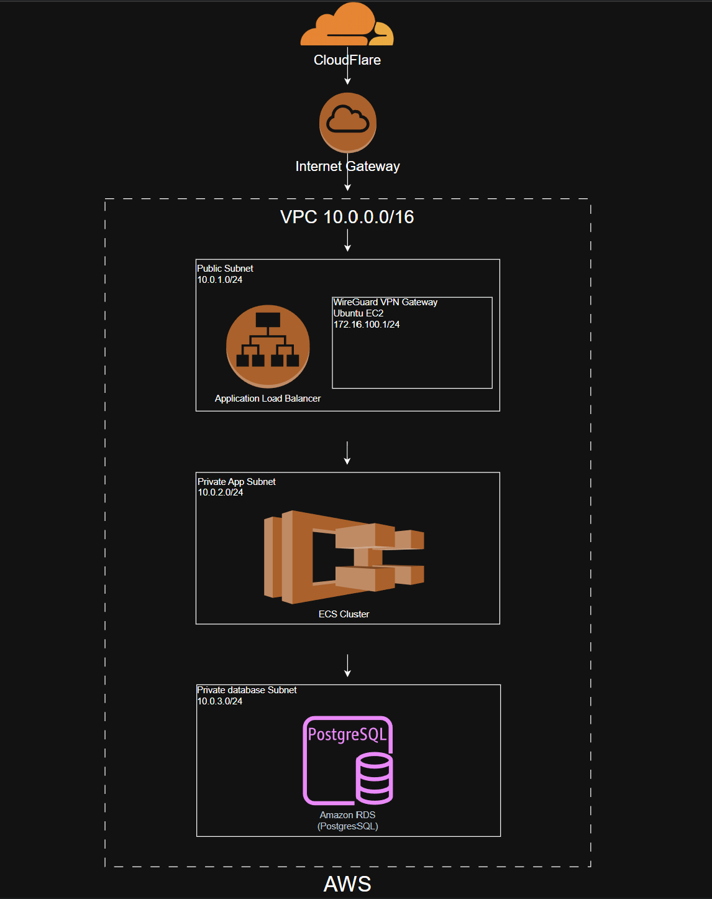

# 05 - AWS Network

# Overview

AWS serves as the production cloud environment and networking hub for the Enterprise Hybrid Cloud Platform.

The AWS environment hosts the central WireGuard VPN hub and provides secure connectivity between Microsoft Azure and the on-premises enterprise network. Future phases of the project will expand AWS to host the production web application and supporting cloud services.

Current responsibilities include:

- Production VPC
- WireGuard VPN Hub
- Linux Routing
- Site-to-Site VPN
- Inter-site Packet Forwarding
- Hybrid Cloud Connectivity

Future responsibilities include:

- React Frontend
- FastAPI Backend
- PostgreSQL Database
- Amazon ECS
- Application Load Balancer
- CloudWatch Monitoring

---

# AWS Architecture



```

AWS functions as the central networking hub for the hybrid cloud.

---

# Virtual Private Cloud

| Property | Value |
|----------|-------|
| VPC CIDR | 10.0.0.0/16 |
| Internet Gateway | Attached |
| Availability Zones | 1 |
| VPN Role | WireGuard Hub |

---

# VPC Subnets

## Public Subnet

```
10.0.1.0/24
```

Current Resources

- Internet Gateway
- Ubuntu WireGuard Gateway

Future Resources

- Application Load Balancer

Purpose

- Public Internet Connectivity
- VPN Termination
- SSH Administration

---

## Application Subnet

```
10.0.2.0/24
```

Future Resources

- Amazon ECS
- React Frontend
- FastAPI Backend

Purpose

- Application Hosting
- Internal Services

---

## Database Subnet

```
10.0.3.0/24
```

Future Resources

- Amazon RDS PostgreSQL

Purpose

- Database Services

---

# AWS WireGuard Gateway

## Ubuntu Server

Purpose

Acts as the central WireGuard VPN hub connecting every enterprise location.

Interfaces

| Interface | Address |
|----------|----------|
| eth0 | 10.0.1.40 |
| wg0 | 172.16.100.1 |

---

## Connected Peers

| Peer | Tunnel Address |
|-------|----------------|
| Azure Gateway | 172.16.100.2 |
| On-Premises Gateway | 172.16.100.3 |

---

## Responsibilities

- WireGuard Hub
- VPN Termination
- Linux IP Forwarding
- Static Routing
- Inter-site Packet Forwarding
- Secure SSH Administration

---

# AWS Routing

AWS acts as the central routing hub.

Remote Networks

```
10.1.0.0/16
10.2.0.0/16
```

Traffic to both remote networks is forwarded through the WireGuard interface.

Example

```
10.1.0.0/16 dev wg0
10.2.0.0/16 dev wg0
```

Default Gateway

```
10.0.1.1
```

---

# Hybrid Cloud Connectivity

AWS provides secure communication with:

## Azure

Current

- WireGuard Gateway
- Windows Server 2025
- Active Directory
- DNS
- Domain Services

Future

- Windows File Server
- Internal Application Server
- Windows 11 Enterprise

---

## On-Premises

Current

- Ubuntu WireGuard Gateway
- Windows 11 Enterprise Workstation
- Kali Linux

Future

- Additional Enterprise Systems

---

# Security

AWS Security Groups restrict inbound traffic to required services.

Allowed

- SSH (22)
- WireGuard UDP (60031)

Future

- HTTP (80)
- HTTPS (443)

Internal application and database services remain private.

---

# Future Production Architecture

```
Internet

↓

Cloudflare DNS

↓

Application Load Balancer

↓

React Frontend

↓

FastAPI Backend

↓

PostgreSQL
```

Production application traffic will remain separate from enterprise VPN traffic.

---

# Current Infrastructure

| Component | Status |
|-----------|--------|
| VPC | Complete |
| Public Subnet | Complete |
| Application Subnet | Complete |
| Database Subnet | Complete |
| Internet Gateway | Complete |
| WireGuard Gateway | Complete |
| Linux Routing | Complete |
| IP Forwarding | Complete |
| Site-to-Site VPN | Complete |
| AWS Route Tables | Complete |
| SSH Administration | Complete |
| ECS | Planned |
| Application Load Balancer | Planned |
| PostgreSQL | Planned |
| CloudWatch | Planned |

---

# Validation

The AWS networking infrastructure has been validated through end-to-end testing.

## WireGuard

Verified

- Tunnel handshakes
- Peer status

Commands

```
wg
```

---

## Routing

Verified

- AWS Route Tables
- Linux Routing

Commands

```
ip route
```

---

## Connectivity

Verified

- AWS ↔ Azure
- AWS ↔ On-Premises
- Azure ↔ On-Premises (via AWS)

Commands

```
ping
```

---

## Route Validation

Verified

```
traceroute
```

---

## SSH

Verified secure administrative access to the AWS WireGuard gateway.

---

# Future Enhancements

Planned improvements include:

- React Frontend
- FastAPI Backend
- PostgreSQL
- Amazon ECS
- Application Load Balancer
- CloudWatch
- GitHub Actions Deployment
- Docker
- Infrastructure as Code (Terraform)
- Multi-AZ Deployment
- Auto Scaling
- AWS Systems Manager

---

# Summary

AWS serves as the networking hub of the Enterprise Hybrid Cloud Platform by providing centralized WireGuard VPN services, Linux routing, and secure communication between Azure and the on-premises enterprise environment.

The current implementation delivers enterprise routing, encrypted site-to-site VPN connectivity, and validated hybrid cloud networking. Future project phases will expand the AWS environment into a production application platform supporting modern web services, automated deployment, monitoring, and cloud-native infrastructure.