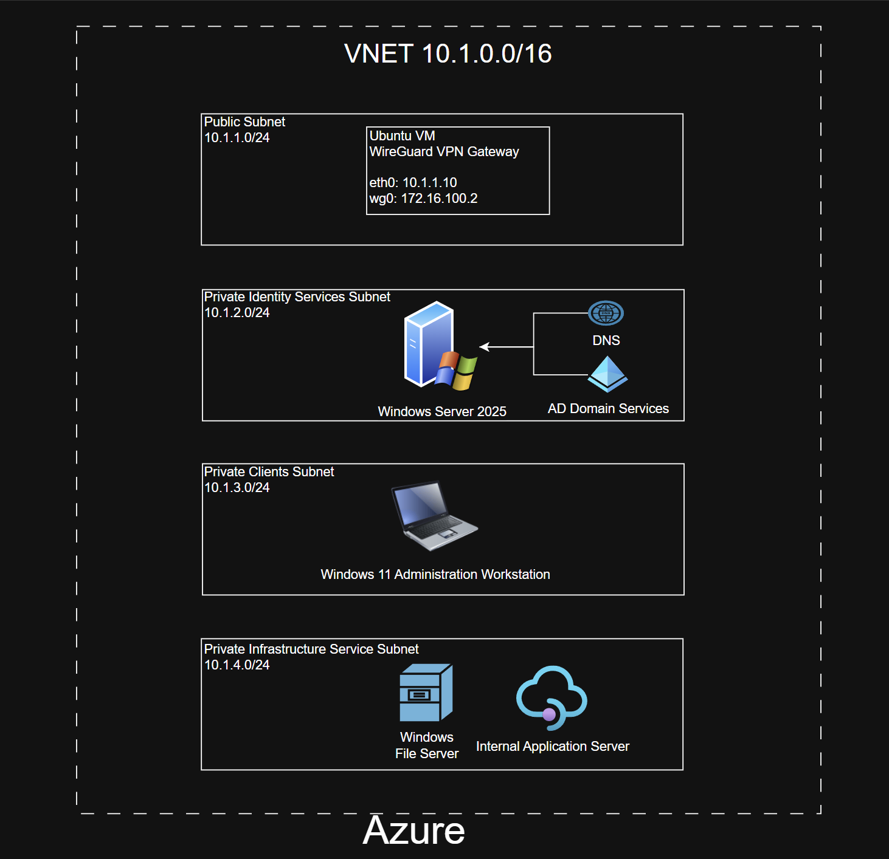

# 06 - Azure Network

# Overview

Microsoft Azure serves as the enterprise identity and infrastructure platform for the Enterprise Hybrid Cloud Platform.

Azure provides centralized identity management through Active Directory Domain Services (AD DS), enterprise DNS, Windows Server administration, and secure hybrid connectivity to AWS and the on-premises enterprise environment using an encrypted WireGuard site-to-site VPN.

Azure represents the organization's corporate datacenter while AWS hosts production networking and the on-premises environment provides enterprise workstations and security operations.

---

# Azure Architecture

```

```

---

# Azure Virtual Network

| Property | Value |
|----------|-------|
| Virtual Network | 10.1.0.0/16 |
| VPN Role | WireGuard Spoke |
| Connected Hub | AWS |
| Route Management | Azure User Defined Routes |

---

# Azure Subnets

## Gateway Subnet

```
10.1.1.0/24
```

Purpose

- WireGuard Gateway
- Secure VPN Connectivity
- Linux Routing

Current Resources

- Ubuntu WireGuard Gateway

---

## Identity Services Subnet

```
10.1.2.0/24
```

Purpose

- Active Directory
- DNS
- Enterprise Identity Services

Current Resources

- Windows Server 2025
- Active Directory Domain Services
- DNS Server

---

## Enterprise Client Subnet

```
10.1.3.0/24
```

Purpose

- Enterprise Workstations

Current Resources

- Windows 11 Enterprise
- Domain-Joined Workstation

---

## Infrastructure Services Subnet

```
10.1.4.0/24
```

Purpose

Enterprise Infrastructure

Future Resources

- Windows File Server
- Internal Application Server

---

# Azure WireGuard Gateway

## Ubuntu Virtual Machine

Purpose

Provides secure encrypted connectivity between Azure, AWS, and the on-premises enterprise network.

Interfaces

| Interface | Address |
|----------|---------|
| eth0 | 10.1.1.4 |
| wg0 | 172.16.100.2 |

Responsibilities

- WireGuard Gateway
- Linux Routing
- IP Forwarding
- VPN Termination
- Secure SSH Administration

---

# WireGuard Configuration

Azure operates as a spoke within the enterprise hub-and-spoke VPN.

Connected Hub

```
AWS
172.16.100.1
```

Advertised Networks

```
10.1.0.0/16
```

Allowed Networks

```
10.0.0.0/16
10.2.0.0/16
```

Persistent Keepalive

```
25 Seconds
```

---

# Enterprise Routing

Azure routing consists of:

- Azure User Defined Routes (UDRs)
- Linux Static Routing
- WireGuard Routing
- IP Forwarding

Remote Networks

```
10.0.0.0/16
10.2.0.0/16
```

Default Gateway

```
10.1.1.1
```

The Azure route table is associated with both the Gateway Subnet and the Identity Services Subnet to enable communication between Azure resources and remote enterprise networks.

---

# Active Directory

## Windows Server 2025

Current Roles

- Active Directory Domain Services
- DNS Server

Configured Services

- Forest
- Domain
- Organizational Units
- Enterprise Users
- Security Groups
- Domain Authentication

Current Organizational Units

- Employees
- Developers
- HR
- IT
- Management
- Workstations
- Servers
- Groups
- Service Accounts

---

# Enterprise Workstations

Current Deployment

- Windows 11 Enterprise
- Domain Joined
- Active Directory Authentication
- Enterprise DNS

Validation

- Domain Login
- Cross-site Authentication
- DNS Resolution

---

# DNS Services

Primary DNS Server

```
Windows Server 2025
10.1.2.4
```

Responsibilities

- Active Directory DNS
- Enterprise Name Resolution
- Cross-site DNS Resolution

Current Validation

- nslookup
- Domain Authentication
- Cross-site Name Resolution

---

# Hybrid Connectivity

Azure currently communicates securely with:

## AWS

Current

- WireGuard Gateway
- Production Network

Future

- Application Services
- Database Services

---

## On-Premises

Current

- Ubuntu WireGuard Gateway
- Windows 11 Enterprise
- Kali Linux

Traffic between all environments traverses the encrypted WireGuard VPN.

---

# Security

Azure Network Security Groups allow only required administrative and infrastructure services.

Allowed

- SSH (22)
- WireGuard UDP (60031)
- RDP (3389)
- DNS (53)
- Kerberos (88)
- LDAP (389)
- LDAPS (636)

Administrative access is restricted to authorized management systems.

---

# Current Infrastructure

| Component | Status |
|-----------|--------|
| Azure Virtual Network | Complete |
| Gateway Subnet | Complete |
| Identity Services Subnet | Complete |
| Enterprise Client Subnet | Complete |
| Infrastructure Services Subnet | Complete |
| Azure User Defined Routes | Complete |
| Route Table Associations | Complete |
| Ubuntu WireGuard Gateway | Complete |
| WireGuard VPN | Complete |
| Windows Server 2025 | Complete |
| Active Directory Domain Services | Complete |
| DNS Server | Complete |
| Organizational Units | Complete |
| Enterprise Users | Complete |
| Security Groups | Complete |
| Windows 11 Enterprise | Complete |
| Domain Join | Complete |
| Cross-site Authentication | Complete |
| Cross-site DNS Resolution | Complete |
| Windows File Server | Planned |
| Internal Application Server | Planned |

---

# Validation

The Azure enterprise infrastructure has been fully validated.

## Networking

Verified

- WireGuard Handshakes
- Azure ↔ AWS Connectivity
- Azure ↔ On-Premises Connectivity
- Route Table Validation
- User Defined Routes

Verification

```
wg
ip route
ping
tracert
```

---

## Identity

Verified

- Active Directory Installation
- Domain Creation
- Organizational Units
- Enterprise Users
- Security Groups

Verification

```
Get-ADUser
Get-ADComputer
```

---

## Authentication

Verified

- Domain Login
- Cross-site Authentication

Verification

```
whoami
```

---

## DNS

Verified

- Enterprise DNS
- Cross-site Name Resolution

Verification

```
nslookup
```

---

# Future Enhancements

Planned improvements include:

- Windows File Server
- Internal Application Server
- Group Policy
- Azure Monitor
- Azure Backup
- Microsoft Defender for Servers
- Microsoft Entra ID Integration

---

# Summary

Microsoft Azure serves as the enterprise identity platform for the Enterprise Hybrid Cloud Platform by providing centralized Active Directory services, enterprise DNS, Windows Server administration, and secure hybrid connectivity to AWS and the on-premises enterprise environment.

The Azure environment now includes a fully operational WireGuard gateway, enterprise routing using Azure User Defined Routes, Active Directory Domain Services, DNS, organizational units, domain-joined Windows 11 workstations, and validated cross-site authentication. This establishes the enterprise identity foundation for future infrastructure services, application hosting, and centralized management.