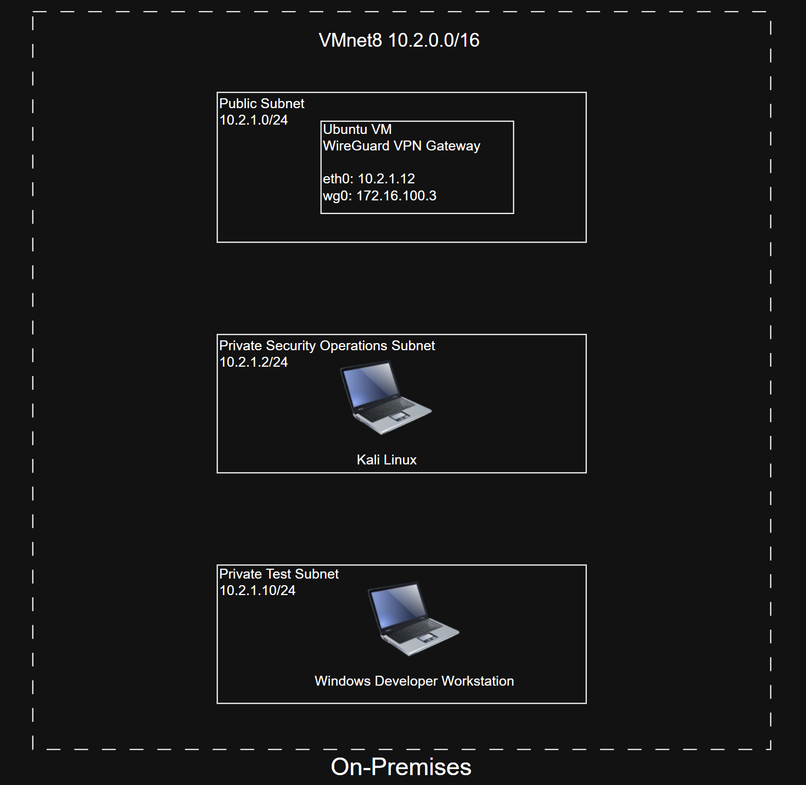

# 07 - OnPremises Enterprise Network

# Overview

The on-premises environment represents the corporate office within the Enterprise Hybrid Cloud Platform. It is hosted on VMware Workstation Pro and provides enterprise workstations, a security operations lab, and a WireGuard VPN gateway that securely connects the local network to Microsoft Azure and Amazon Web Services (AWS).

The on-premises environment demonstrates how traditional enterprise infrastructure can securely integrate with public cloud platforms using a hybrid cloud architecture.

---

# Objectives

The on-premises network was designed to:

- Simulate a corporate office environment
- Provide enterprise developer workstations
- Host a dedicated security operations lab
- Establish secure connectivity to AWS and Azure
- Demonstrate enterprise network segmentation
- Support hybrid Active Directory authentication
- Validate cross-site routing and communication

---

# Network Overview

| Property | Value |
|----------|-------|
| Platform | VMware Workstation Pro |
| Network | VMnet8 |
| Address Space | 10.2.0.0/16 |
| VPN Tunnel | WireGuard |
| Tunnel Address | 172.16.100.3 |

---

# Network Architecture

```
```

---

# Network Components

## Ubuntu WireGuard Gateway

The Ubuntu gateway provides secure connectivity between the on-premises environment and the cloud infrastructure.

### Responsibilities

- WireGuard VPN endpoint
- Layer 3 routing
- Linux IP forwarding
- Static routing
- Packet forwarding
- Secure SSH administration

### Configuration

| Interface | Address |
|-----------|----------|
| eth0 | 10.2.1.12 |
| wg0 | 172.16.100.3 |

---

## Windows 11 Enterprise Workstation

The Windows workstation represents a corporate developer workstation.

### Current Configuration

- Windows 11 Enterprise
- Domain Joined
- Active Directory Authentication
- DNS provided by Azure Domain Controller
- Remote Desktop enabled
- Development workstation

### User Accounts

- Eric.Admin
- Eric.Developer

The workstation authenticates directly against the Azure-hosted Active Directory domain controller across the encrypted WireGuard VPN.

---

## Kali Linux Security Workstation

The Kali Linux virtual machine serves as the organization's security operations and penetration testing workstation.

### Current Tools

- Kali Linux
- SSH
- Networking Utilities

### Planned Tools

- Burp Suite Community
- OWASP ZAP
- Nmap
- Wireshark
- Custom Python Security Tools

Security testing is performed only against infrastructure owned and managed within this project.

---

# Network Segmentation

The on-premises environment is divided into dedicated network segments.

| Subnet | Purpose |
|---------|----------|
| 10.2.1.0/24 | Infrastructure |
| 10.2.2.0/24 | Security Operations |
| 10.2.3.0/24 | Developer Workstations |

Network segmentation improves security by separating infrastructure, user devices, and security testing resources.

---

# Hybrid Connectivity

The on-premises network connects to AWS and Azure using a WireGuard hub-and-spoke VPN.

### AWS

- WireGuard VPN Hub
- Network: 10.0.0.0/16

### Azure

- Active Directory
- DNS
- Network: 10.1.0.0/16

All communication is encrypted before traversing the public Internet.

---

# Routing

The Ubuntu gateway performs Layer 3 routing between the local VMware network and remote cloud environments.

Validated routes include:

- On-Premises → AWS
- On-Premises → Azure
- Azure → On-Premises
- AWS → On-Premises

Routing is accomplished through:

- Linux IP forwarding
- Static routes
- WireGuard AllowedIPs
- VMware virtual networking

---

# DNS Resolution

DNS services are provided by the Windows Server 2025 domain controller hosted in Azure.

Verified functionality includes:

- Domain name resolution
- Active Directory lookups
- Cross-site DNS queries
- Enterprise authentication

Example verification:

```powershell
nslookup corp.ericrobinsonjr.com
```

---

# Authentication

The Windows 11 workstation authenticates against the Azure Active Directory domain controller.

Authentication flow:

```
Windows 11

↓

WireGuard VPN

↓

Azure Domain Controller

↓

Kerberos Authentication

↓

Enterprise Resource Access
```

---

# Security

Current security controls include:

- WireGuard site-to-site VPN
- Linux firewall
- Static routing
- SSH administration
- Active Directory authentication
- Domain-based user accounts
- Network segmentation

---

# Validation

The on-premises infrastructure has been successfully validated.

## Infrastructure

Verified

- VMware networking
- Ubuntu gateway
- Windows 11 Enterprise
- Kali Linux

---

## Networking

Verified

- WireGuard tunnel
- Static routing
- Linux IP forwarding
- End-to-end connectivity

Verification commands:

```bash
wg

ip addr

ip route

ping
```

---

## Identity

Verified

- Domain join
- Active Directory authentication
- DNS resolution
- Enterprise user logon

Verification:

```powershell
whoami

systeminfo

hostname
```

---

# Current Status

| Component | Status |
|-----------|--------|
| VMware Workstation | ✅ Complete |
| Ubuntu WireGuard Gateway | ✅ Complete |
| WireGuard VPN | ✅ Complete |
| Static Routing | ✅ Complete |
| Linux IP Forwarding | ✅ Complete |
| Windows 11 Enterprise | ✅ Complete |
| Domain Join | ✅ Complete |
| Active Directory Authentication | ✅ Complete |
| DNS Resolution | ✅ Complete |
| Kali Linux Security Workstation | ✅ Complete |

---

# Future Enhancements

Planned improvements include:

- Docker Desktop
- Kubernetes Development
- Visual Studio Code Remote Development
- Enterprise automation scripts
- Infrastructure orchestration
- Automated VM startup and shutdown
- Terraform integration
- Configuration management with Ansible

---

# Summary

The on-premises enterprise network provides a realistic corporate office environment integrated into the Enterprise Hybrid Cloud Platform. Hosted on VMware Workstation Pro, it includes a Windows 11 Enterprise developer workstation, a Kali Linux security workstation, and an Ubuntu WireGuard gateway that securely connects the local network to AWS and Microsoft Azure.

The completed deployment demonstrates enterprise network segmentation, hybrid Active Directory authentication, secure site-to-site VPN connectivity, centralized DNS services, and validated cross-site communication, providing a production-style foundation for software development, infrastructure automation, and cybersecurity operations.