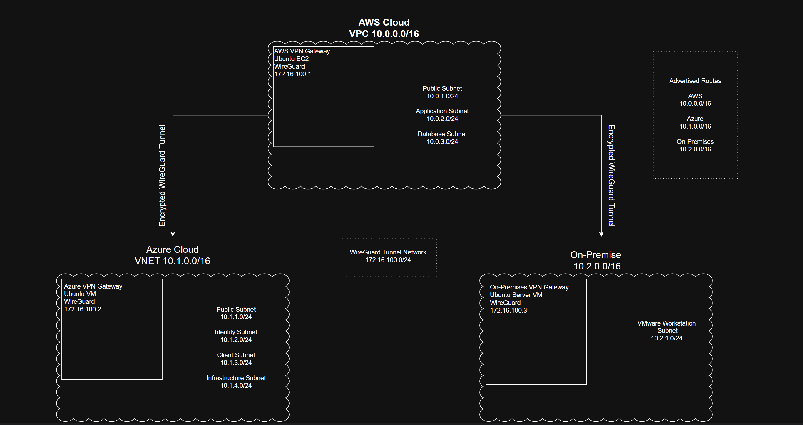

# 08 - VPN Architecture

# Overview

The Enterprise Hybrid Cloud Platform uses a production-style WireGuard hub-and-spoke Virtual Private Network (VPN) architecture to securely connect Amazon Web Services (AWS), Microsoft Azure, and an on-premises VMware enterprise environment.

The VPN provides encrypted Layer 3 connectivity between all enterprise locations, allowing cloud resources and on-premises infrastructure to communicate as a single private network while traversing the public Internet securely.

AWS functions as the central VPN hub while Azure and the on-premises enterprise environment operate as spoke sites.

---

# Design Objectives

The VPN architecture was designed to provide:

- Secure hybrid cloud connectivity
- Encrypted site-to-site communication
- Centralized enterprise routing
- Secure remote administration
- Enterprise scalability
- Simplified network management
- Secure Active Directory communication
- Cross-site authentication
- Cross-site DNS resolution

---

# Enterprise VPN Topology


```

```

AWS functions as the central routing hub.

Azure and the on-premises environment never establish a direct VPN tunnel. All communication between the spoke sites traverses the AWS WireGuard gateway.

---

# WireGuard Tunnel Network

Tunnel Network

```
172.16.100.0/24
```

| Gateway | Tunnel Address |
|----------|----------------|
| AWS Hub | 172.16.100.1 |
| Azure Gateway | 172.16.100.2 |
| On-Premises Gateway | 172.16.100.3 |

---

# Hub-and-Spoke Design

A hub-and-spoke architecture was selected instead of a full mesh VPN.

Benefits include:

- Centralized routing
- Simplified VPN management
- Fewer VPN tunnels
- Easier troubleshooting
- Lower administrative overhead
- Simplified expansion
- Consistent security policies

New enterprise locations require only a single VPN connection to the AWS hub.

---

# AWS VPN Hub

AWS serves as the central routing point for all enterprise VPN traffic.

Current Responsibilities

- WireGuard Hub
- VPN Termination
- Linux IP Forwarding
- Static Routing
- Inter-site Packet Routing

Interfaces

| Interface | Address |
|----------|---------|
| eth0 | 10.0.1.40 |
| wg0 | 172.16.100.1 |

Remote Networks

```
10.1.0.0/16
10.2.0.0/16
```

---

# Azure VPN Gateway

Azure operates as a WireGuard spoke.

Interfaces

| Interface | Address |
|----------|---------|
| eth0 | 10.1.1.4 |
| wg0 | 172.16.100.2 |

Responsibilities

- VPN Termination
- Linux Routing
- IP Forwarding
- Secure Enterprise Connectivity

Advertised Network

```
10.1.0.0/16
```

Allowed Networks

```
10.0.0.0/16
10.2.0.0/16
```

Persistent Keepalive

```
25 Seconds
```

---

# On-Premises VPN Gateway

The on-premises Ubuntu server operates as a WireGuard spoke.

Interfaces

| Interface | Address |
|----------|---------|
| eth0 | 10.2.1.12 |
| wg0 | 172.16.100.3 |

Responsibilities

- VPN Gateway
- Linux Routing
- Secure SSH Administration

Advertised Network

```
10.2.0.0/16
```

Allowed Networks

```
10.0.0.0/16
10.1.0.0/16
```

Persistent Keepalive

```
25 Seconds
```

---

# Enterprise Routing

The VPN relies on static routing across all enterprise environments.

## AWS

Routing Components

- AWS Route Tables
- Linux Routing
- WireGuard

Routes

```
10.1.0.0/16
10.2.0.0/16
```

---

## Azure

Routing Components

- Azure User Defined Routes
- Linux Routing
- WireGuard

Routes

```
10.0.0.0/16
10.2.0.0/16
```

The Azure route table is associated with both the Gateway Subnet and the Identity Services Subnet to enable communication between Azure resources and remote enterprise networks.

---

## On-Premises

Routing Components

- Linux Static Routes
- Windows Persistent Routes
- WireGuard

Routes

```
10.0.0.0/16
10.1.0.0/16
```

---

# Security Architecture

WireGuard provides encrypted communication between all enterprise locations.

Security objectives include:

- Confidentiality
- Integrity
- Mutual Authentication
- Secure Key Exchange
- Private Enterprise Networking

Administrative access is performed using secure SSH and Remote Desktop connections.

---

# Enterprise Traffic Flow

The VPN supports secure communication between:

- AWS ↔ Azure
- AWS ↔ On-Premises
- Azure ↔ On-Premises

Azure-to-On-Premises traffic follows this path:

```
Azure

↓

Azure WireGuard Gateway

↓

AWS WireGuard Hub

↓

On-Premises WireGuard Gateway

↓

Destination Host
```

This centralized routing model simplifies network administration while maintaining encrypted communication between all enterprise locations.

---

# Scalability

The hub-and-spoke architecture supports future expansion including:

- Additional AWS Regions
- Additional Azure Regions
- Branch Offices
- Remote Employees
- Disaster Recovery Sites
- Additional Cloud Providers

Each new location requires only a single VPN connection to the AWS hub.

---

# High Availability

The current implementation uses a single WireGuard hub hosted in AWS.

Future enhancements may include:

- Redundant VPN Gateways
- Multi-Region Deployment
- Automatic Failover
- Dynamic Routing Protocols
- High Availability Networking

---

# Validation

The VPN architecture has been fully validated.

## WireGuard

Verified

- Tunnel Handshakes
- Peer Status
- Tunnel Interfaces

Verification

```
wg
```

---

## Routing

Verified

- AWS Route Tables
- Azure User Defined Routes
- Linux Static Routes
- Windows Persistent Routes

Verification

```
ip route
route print
```

---

## Connectivity

Verified

- AWS ↔ Azure
- AWS ↔ On-Premises
- Azure ↔ On-Premises

Verification

```
ping
```

---

## Route Validation

Verified

```
tracert
```

---

## DNS

Verified

- Cross-site DNS Resolution

Verification

```
nslookup
```

---

## Active Directory

Verified

- Cross-site Domain Authentication
- Domain-Joined Windows Workstations

Verification

```
whoami
Get-ADUser
Get-ADComputer
```

---

# Current Status

## Completed

### VPN

- WireGuard Hub
- Azure WireGuard Spoke
- On-Premises WireGuard Spoke
- Hub-and-Spoke Topology
- Site-to-Site VPN

### Routing

- AWS Route Tables
- Azure User Defined Routes
- Linux Routing
- Windows Persistent Routes
- Linux IP Forwarding
- Cross-Site Routing

### Validation

- WireGuard Handshakes
- ICMP Testing
- Route Validation
- DNS Resolution
- Active Directory Authentication
- SSH Administration

---

# Future Enhancements

Planned improvements include:

- Dynamic Routing (BGP)
- High Availability VPN
- Multi-Region Deployment
- VPN Monitoring
- Infrastructure as Code (Terraform)
- Automated Configuration Management

---

# Summary

The Enterprise Hybrid Cloud Platform implements a production-style WireGuard hub-and-spoke VPN architecture that securely integrates AWS, Microsoft Azure, and an on-premises enterprise environment into a single private network.

The completed implementation includes encrypted site-to-site connectivity, enterprise routing, Linux IP forwarding, Azure User Defined Routes, Windows persistent routes, cross-site DNS resolution, Active Directory authentication, and validated communication between every environment. This VPN infrastructure provides the secure networking foundation for enterprise identity services, application hosting, DevOps automation, and future production workloads.